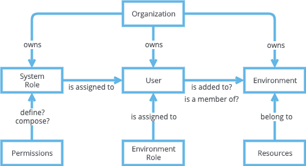
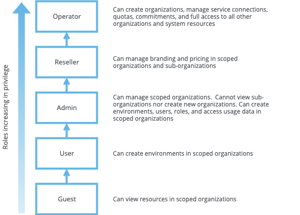
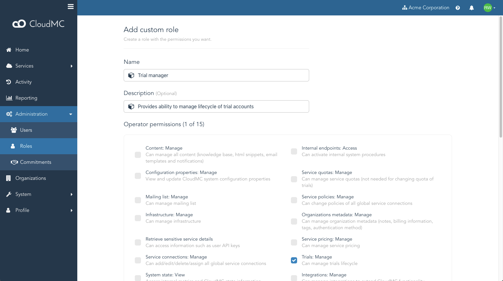
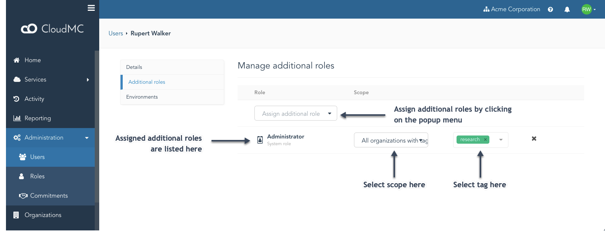

# Administrator guide: Role-based access controls

Access control in CloudMC is achieved through a flexible, multi-tenant model that provides a simplified way to manage permissions across a hierarchy of organizations and environments.  Role-based access control (RBAC) features built into CloudMC allow fine-grained control over the permissions which are granted to users.

## Definitions
- **Permission:** An authorization to execute a particular task.  **System permissions** govern access to functionality in the CloudMC console, **environment permissions** govern access to a service's resources

- **System Role:** A collection of system permissions inside an organization.  CloudMC comes with five **fixed roles** which cannot be modified, and **custom roles** can be created.  Generally, system roles are referred to simply as "roles"

- **Scope:** The organization or organizations to which a system role is applied

- **Organization:** A grouping of related end-users.  A base installation of CloudMC comes with the **System** organization

- **User:**  A user account is how an individual connects to the CloudMC portal.  A user is always assigned a primary system role in a single organization. A user can be assigned additional system roles, which can be scoped to one or more organizations

- **Environment:**  A logical unit within an organization, used to isolate and group resources securely. Access is controlled via a combination of environment roles and organization access controls

- **Environment Role:** A defined collection of environment permissions that is applied to the members of an environment

## System roles

The function of a system role is to control access to CloudMC functionality in a simple, standard way.  A system role can be assigned to users within an organization.  System roles are enforced in the Web user interface as well as in the CloudMC API.  Custom roles can define permissions that are aligned to business needs, and can also enable cross-organization collaboration.

All system roles have a *scope*, which can be any of the following: [MIGHT CREATE DIAGRAMS]
- All organizations in CloudMC
- Only the top-level organizations
- A specific organization but not its sub-organizations
- A specific organization and all of its sub-organizations
- Only the sub-organizations of a specific organization
- All organizations with a specific tag

Through the use of tagging, scope for an assigned role can be automatically extended to organizations that get tagged, and removed when a tag is erased.  This feature enables scenarios where role scope changes dynamically based on business rules.

### Fixed roles
The five roles included with CloudMC are applicable to a broad range of use cases.  They can be assigned to a user's primary role, or as an additional role.

Summary of each system role when applied as a primary role in a single organization or sub-organization:
- **Guest:** A read-only role.  Can view resources in assigned environments
- **User:** Can create new environments with existing service connections, and manage environments owned by the user.  Cannot see any existing environments until the user is added to them
- **Administrator:** Can manage the organization. Can manage all environments in all service connections.  Cannot view sub-organizations nor create new sub-organizations.
- **Reseller:** Can manage branding and pricing in scoped organizations and sub-organizations, can create sub-organizations in the organization, but not new organizations
- **Operator:** Can create organizations and sub-organizations, manage service connections, quotas, commitments, and has full access to all other organizations, system resources and settings

Each system role has a default scope:
- Guest, User, Administrator: Only the organization in which the user exists
- Reseller: The organization in which the user exists and all of its sub-organizations
- Operator: All organizations

As the diagram below indicates, rising through the hierarchy every role has all of the privileges as the preceding one:

### Custom Roles

CloudMC allows users with the *Administrator* role and higher (or users with a custom role that includes the *Roles:Manage* permission, explained in this section) to create new roles with permissions that are aligned with specific business needs.  The administrator can select individual permissions and save the role, then apply that role to users within the organization.  A user's effective rights are governed by the union of all the permissions and scope of the primary role with all additional roles.  A user's primary role must be one of the five fixed roles, it cannot be a custom role.

**Important:** When an organization is deleted, any custom roles that were defined within that organization are also deleted.

#### Creating a custom role
The *Administration* -> *Roles* page lists system roles and any custom roles that have been created in the organization.  To add a custom role, click the *Add custom role* button at the upper-right corner of the page.  On the *Add custom role* page, enter a name, an optional description, and then select the desired permissions to assign to the role.  Permissions are named in the format *Feature:Operation* and are grouped according to the system role that they are assigned by default.

## Environment roles
To control access to resources within an environment, CloudMC introduces the concept of the *environment role*.  When adding a new member to an environment, that user must be assigned an environment role, which governs the level of access this user will be granted within the environment.  Most plugins ship with these standard environment roles:

- **Viewer:**  Read-only access to the environment
- **Editor:** Can modify all features of the environment, but cannot change the environment settings nor manage users
- **Owner:** Adds the ability to change the environment settings and to manage users

## How to assign roles

Primary roles are assigned to a user in the *Edit user* page.

Additional roles are assigned to a user by going to the *Edit user* page and clicking on *Additional roles*

Environment roles are assigned to a user when adding members to an environment, by navigating to the desired service, clicking on the three-dot menu to the right of the desired environment, and typing a name in the text box labeled *Add member to environment*:

---
[Use cases - Basic](use-cases-basic-en.md)

[Use cases - Advanced](use-cases-advanced-en.md)
