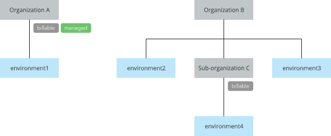

# Use cases: Advanced
The following are use cases to illustrate the flexibility of CloudMC roles with real-world examples.  Unless otherwise indicated, the examples assume an account that has a primary role of *Guest*, no additional roles,  *Viewer* access on at least one environment in the organization, and that the account is created in the organization intended to be accessed.  These are examples only, individual needs will vary.

The diagram below depicts two hypothetical organizations with environments and a sub-organization.  Note that Organization A has two tags, **billable** and **managed**, and Sub-organization C has one tag, **billable**.

| Scenario | Suggested role name | Role configuration | Notes from example |
| --- | --- | --- | --- |
| View usage information for organizations that are marked as billable | Finance Administrator | Additional custom role with the *Usage: View* permission and scoped to **All organizations with a specific tag**, and specify the tag **billable**  | If the **billable** tag is removed from Organization A, this user would no longer be able to view usage data for that organization |
| Manage all environments in an organization, but not the organization itself | Environment Administrator | Primary role *User*, additional custom role with all Admin privileges except *Organizations:Manage* and *Roles:Manage*, scoped to the organization. Account will full access to all environments in the organization | Applied to a user in Organization B, this access would be granted to environment2 and environment3, but not to environment4 |
| Administrator of one organization and all of its sub-organizations | Sub-org Administrator | Primary role *Administrator*, then an additional role of *Administrator* with a scope of **Specific organization and subs**, and specify the organization. Account will have full access to all environments in the organization | Applied to a user in Organization B, this access would be granted to both Organization B and Sub-organization C |
| Manage all environments and sub-organizations across multiple organizations | Managed Services Administrator | Tag the relevant customer organizations with the same unique tag.  Additional role of Administrator, scoped to **All organizations with a specific tag**, and specify the tag.  When new organizations are created with the tag, the administrator will automatically get the appropriate access  | If the **managed** tag is added to Organization B, this access will be granted to that organization, but not to Sub-organization C |
| Give User-level access for an environment to a user outside of the organization |  Not applicable | Check the *Allow external members* box in the *Edit environment* page, then go to *Manage members* and type the user's name in the search box.  Users from outside the organization appear in the section of the results titled *Users from other organizations*.  Select the user and apply the desired environment role | On environment2, adding a member from Organization A will give the user this access to environment2 |
