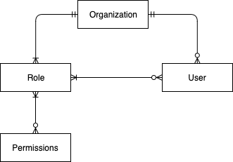
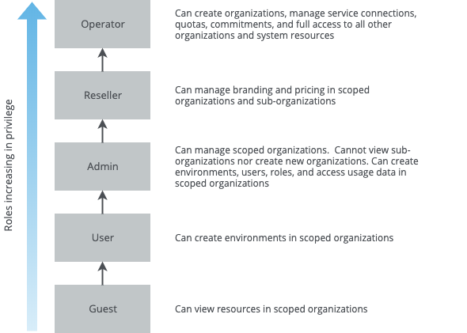
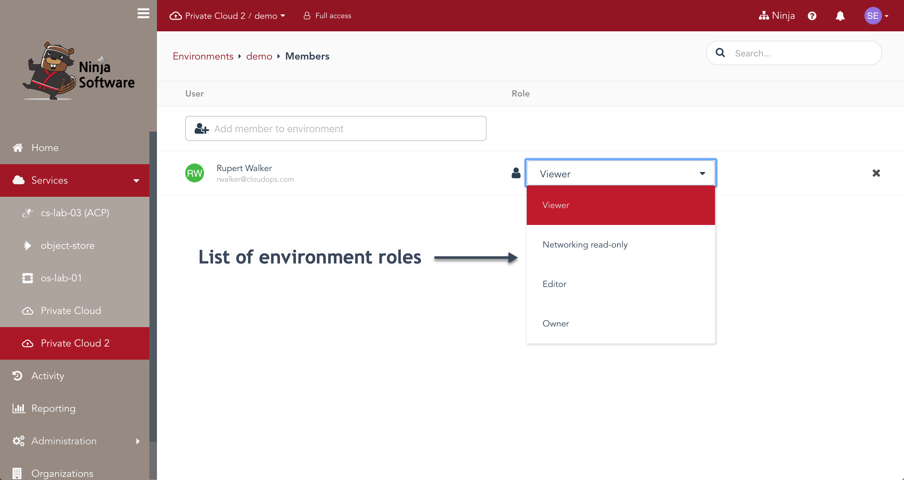
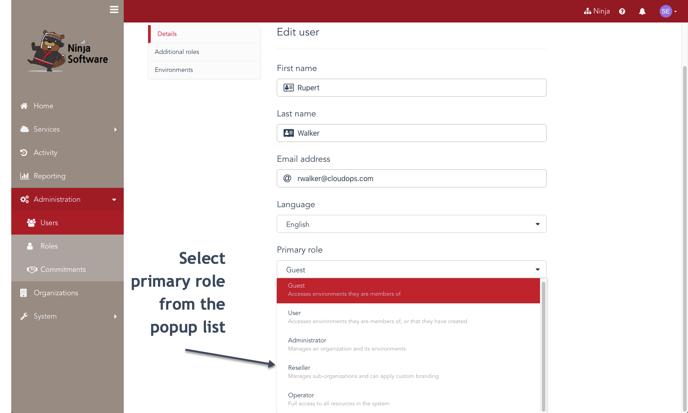
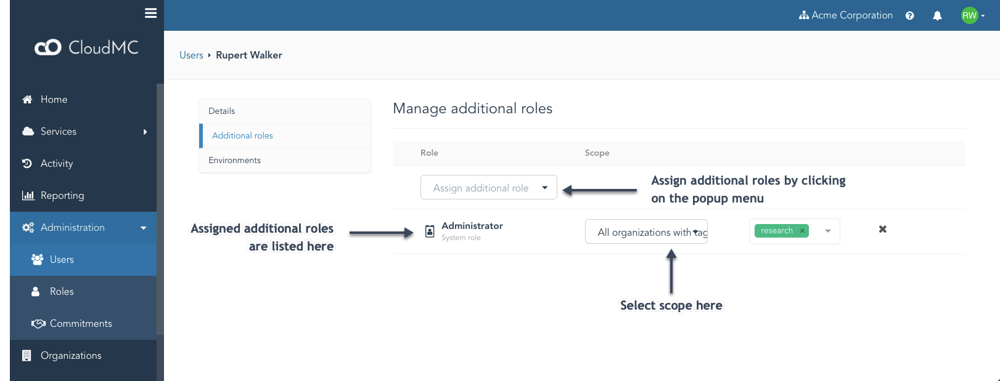

# Administrator guide: Role-based access controls

Access control in CloudMC is achieved through a flexible, multi-tenant model that provides a simplified way to manage permissions across a hierarchy of organizations and environments.  Role-based access control (RBAC) features built into CloudMC allow fine-grained control over the permissions which are granted to users.

## Definitions
- Permission: An authorization to execute a particular task.  System permissions govern the CloudMC console, environment permissions govern a service's virtual resources

- Role: A defined collection of system permissions inside an organization.  CloudMC comes with five system roles which cannot be modified.  Custom roles can be created

- Scope: The organization or organizations to which a role is applied

- Organization: A logical unit to which users and service connections can be assigned.  A base installation of CloudMC comes with the System organization

- User:  A user account is how an individual connects to the CloudMC portal.  A user is always assigned a primary role in a single organization. A user can be assigned additional roles, which can be scoped to one or more organizations

- Environment:  A logical unit within an organization, used to isolate and group resources securely. Access is controlled via a combination of environment roles and organization access controls

 (Simplify and prettify the diagram)

## Using roles to enforce user access

The function of a role is to provide a simple and standard set of system permissions to assign to users within an organization.  Custom roles can define permissions that are aligned to business needs, and when assigned custom roles can provide access to a different organization.  Roles are enforced in the Web user interface as well as in the CloudMC API.

Roles have a *scope*, which can be any of the following:
- All organizations in CloudMC
- Only the top-level organizations
- A specific organization but not its sub-organizations
- A specific organization and all of its sub-organizations
- Only the sub-organizations of a specific organization
- All organizations with a specific tag

### System roles
The five roles included with CloudMC are applicable to a broad range of use cases.  They can be assigned to a user's primary role, or as an additional role.

Summary of each system role when applied as a primary role in a single organization or sub-organization:
- **Guest**: A read-only role.  Can view resources in assigned environments
- **User**: Can create new environments with existing service connections, and manage environments owned by the user.  Cannot see any existing environments until the user is added to them
- **Administrator**: Can manage the organization. Can see all environments in all service connections.  Cannot view sub-organizations nor create new sub-organizations.
- **Reseller**: Can manage branding and pricing in scoped organizations and sub-organizations, can create sub-organizations in the organization, but not new organizations
- **Operator**: Can create organizations and sub-organizations, manage service connections, quotas, commitments, and has full access to all other organizations, system resources and settings

Each system role has a default scope:
- Guest, User, Administrator: Only the organization in which the user exists
- Reseller: The organization in which the user exists and all of its sub-organizations
- Operator: All organizations

As the diagram below indicates, going up the chain each role has all of the privileges as the preceeding one:

### Custom Roles

CloudMC allows users with the *Roles:Manage* permission (such as the *Administrator* role and higher) to create new roles with permissions that are aligned with specific business needs.  The administrator can select individual permissions and save the role, then apply that role to users within the organization.  Custom roles are applied to a user by joining the permissions of all the user's assigned roles.  A user's primary role must be one of the five standard roles, never a custom role.

**Important**: When an organization is deleted, any custom roles that were defined within that organization are also deleted.

#### Creating a custom role
The *Administration* -> *Roles* page lists system role and any custom roles that have been created in the organization.  To add a custom role, click the *Add custom role* button at the upper-right corner of the page.

### Environment roles
When adding a new member to an environment, that user must be assigned an environment role, which governs the level of access this user will be granted within the environment:

- **Viewer**:  Read-only access to the environment
- **Networking read-only**: Can modify instances and storage, but has read-only access for network configuration features
- **Editor**: Can modify all features of the environment, but cannot change the environment settings nor manage users
- **Owner**: Adds the ability to change the environment settings and to manage users

Members are added by navigating to the desired service, clicking on the three-dot menu to the right of the desired environment, and typing a name in the text box labeled *Add member to environment*:

## How to use roles

Primary roles are assigned to a user in the *Edit user* page.

Additional roles are assigned to a user by going to the *Edit user* page and clicking on *Additional roles*

The following are use cases to illustrate the flexibility of CloudMC roles with real-world examples.  Unless otherwise indicated, the examples assume an account that has a primary role of *Guest*, no additional roles,  *Viewer* access on at least one environment in the organization, and that the account is created in the organization intended to be accessed.  These are examples only, individual needs will vary.

#### Operations

| Scenario | Role configuration |
| --- | --- |
| Manage all environments in an organization, but not the organization itself (Environment Administrator) | Primary role *User*, additional custom role with all Admin privileges except *Organizations:Manage* and *Roles:Manage*, scoped to the organization. Account will inherit *Owner* role over all environments in the organization |
| Administrator of one organization and all of its sub-organizations (Sub-org Administrator) | Primary role *Administrator*, then an additional role of *Administrator* with a scope of **Specific organization and subs**, and specify the organization. Account will inherit ownership role over all environments in the organization |
| Manage instances and storage, but no networking access (Networking read-only) | Primary role *User*, add user to the target environment with the *Networking read-only* environment role |
| Manage all environments and sub-organizations across multiple organizations (Managed Services Administrator) | Tag the relevant customer organizations with the same unique tag.  Create the account in a separate organization.  Additional role of Administrator, scoped to **All organizations with a specific tag**, and specify the tag.  When new organizations are created with the tag, the administrator will automatically get the appropriate access  |
| Give User-level access for an environment to a user outside of the organization | Check the *Allow external members* box in the *Edit environment* page, then go to *Manage members* and type the user's name in the search box.  Users from outside the organization appear in the section of the results titled *Users from other organizations* [TEST THIS] |

#### Administration
| Scenario | Role configuration |
| --- | --- |
| Access to dashboards, view lists of resources | Primary role *Guest*, "Viewer" access on the assigned environments in the organization |
| View usage information for organizations that are marked as billable (Finance Administrator) | Additional custom role with the *Usage: View* permission and scoped to **All organizations with a specific tag**, and specify the tag **billing**  |
| Approve, deny, and purge trial organizations (Trials Administrator) | Additional custom role with the *Trials:Manage* permission.  Role must use *All organizations* for scope. |
| Create and delete users only (User Manager) | Additional custom role with the *Usage:View* permission, scoped for the desired organizations |
| Create, edit, and delete knowledge base articles | Additional custom role with the *Content:Manage* permission.  Role must use *All organizations* for scope.  Will also cause the *Go to Legacy UI* option to appear in the avatar menu in the upper right corner  |
| Administer but not create organizations, nor change pricing.  Has all other privileges within the organization and environments | Primary role *Guest*, additional role with all Reseller, Admin, and User permissions except for *Monetization:Manage* |
| Select logos and colour schemes (Branding manager) | Additional custom role with the permission *Branding:Manage*, scoped to the desired organizations |
