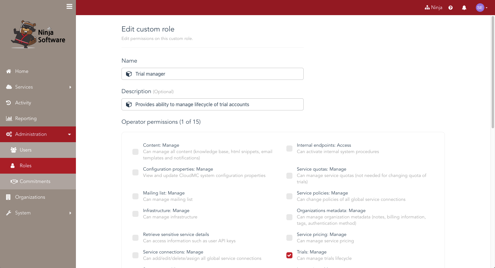

# Role-based access controls

Access control in CloudMC is achieved through a flexible, multi-tenant model that provides a simplified way to manage permissions across a hierarchy of organizations and environments.  Role-based access control (RBAC) features built into CloudMC allow fine-grained control over the permissions which are granted to users.

## Definitions
- Permission: An authorization to execute a particular task.  CloudMC has system permissions which govern the CloudMC console, and environment permissions which govern a service's virtual resources.

- Role: A defined collection of permissions inside an organization.  CloudMC comes with five system roles which cannot be modified: Operator, Reseller, Administrator, User, Guest.  Custom roles can be created.  

- Scope: The organization or organizations to which a role is applied.

- Organization: A logical unit to which users and service connections can be assigned.  A base installation of CloudMC comes with the System organization.  When an organization is deleted, any custom roles that were defined within that organization are also deleted.

- User:  A user account is how an individual connects to the CloudMC portal.  A user is always assigned a primary role in a single organization. A user can be assigned additional roles, which can be scoped to one or more organizations, thereby giving a user permission to access that other organization with the permissions defined in the role.

- Environment:  A logical unit within an organization, used to isolate and group resources securely. Access is controlled via a combination environment roles and organization access controls.

## Using roles to enforce user access to organizations and environments

The function of a role is to provide a simple and standard set of system permissions to users within an organization.  Custom roles can define permissions that are aligned to your business needs, and also to provide access to a user in a different organization.  Roles are enforced in the Web UI as well as in the CloudMC API.

Roles have a *scope*, which can be any of the following:
- All organizations in CloudMC
- Only the top-level organizations
- A specific organization but not its sub-organizations
- A specific organization and all of its sub-organizations
- Only the sub-organizations of a specific organization
- All organizations with a specific tag

### System roles

The five roles included with CloudMC are applicable to a broad range of use cases.  They can be assigned to a user's primary role, or as an additional role.

Summary of each system role when applied as a primary role:
- Guest: A read-only role.  Can view resources in the user's organization.
- User: Can create new environments with service connections, and manage environments owned by the user.  Cannot see any existing environments until the user is added to the environments.
- Administrator: Can manage the organization. Can see all environments in all service connections.  Cannot view sub-organizations nor create new sub-organizations.
- Reseller: Can manage branding and pricing in scoped organizations and sub-organizations.
- Operator: Can create organizations, manage service connections, quotas, commitments, and full access to all other organizations and system resources.

Each system role has a default scope:
- Guest: Only the organization in which the user exists
- User: Only the organization in which the user exists
- Administrator: Only the organization in which the user exists  
- Reseller: The organization in which the user exists and all of its sub-organizations
- Operator: All organizations

## Custom Roles

CloudMC allows [admins?] to create new roles with permissions that are aligned with specific business needs.  The [administrator] can select individual permissions and save the role, then apply that role to users within the organization.  Custom roles are applied to a user by joining the permissions of all the user's assigned roles.  A user's primary role must be one of the five standard roles, never a custom role.

### Creating a custom role

### Environment roles
- Viewer:  Read-only access to the environment
- Networking read-only: Can modify instances and storage, but gets read-only access for network configuration features
- Editor: Can modify all features of the environment, but cannot change the environment settings nor manage users
- Owner: Adds the ability to change the environment settings and to manage users

### How to use roles

Primary roles are assigned to a user in the *Edit user* page.

Additional roles are assigned to a user by going to the *Edit user* page and clicking on *Additional roles*

The following are use cases to illustrate some ways that roles can be used, based on the different kinds of access that a user may need.

#### Operations
Unless otherwise indicated, an account in the table below is assumed to be created in the organization intended to be managed, by an Operator in the System organization.  This may affect the scope of the organization when applying a desired role.

| Desired access | Role to use |
| --- | --- |
| Management of | Set primary role to Administrator |
| Administrator of one organization and all of its sub-organizations | Set primary role to Administrator, then an additional role of Administrator with a scope of "Specific organization and subs", and specify the organization. |
| Access instances and storage, but no networking access | Create user account with User primary role, then add user to the target environment with the *Networking read-only* environment role |
| Administrator of customers | Create the account in System, give it Administrator role, then tag the relevant customer organizations with the same unique tag.  Add an additional role of Administator, scoped to the given tag |
| Give User-level access for an environment to a user outside of the organization | Check the *Allow external members* box in the *Edit environment* page, then go to *Manage members* and type the user's name in the search box.  Users from outside the organization appear in the section of the results titled *Users from other organizations* |

#### Administration
| Desired access | Role to use |
| --- | --- |
| Billing administrator | Set primary role to Guest, create a custom role, grant only the  *Usage: View* permission |
| Approve, deny, and purge trial organizations | Add the *Trials:Manage* permission.  Role must use *All organizations* for scope |
| User manager, in the event that security is owned by a separate department like TecSYS | Guest account, add *Usage:View* permission |
| Create, edit, and delete knowledge base articles | Add the *Content:Manage* permission.  Role must use *All organizations* for scope.  Will also cause the *Go to Legacy UI* option to appear in the avatar menu in the upper right corner  |
| Administer but not create organizations, nor change pricing.  Has all other privileges within the organization and environments | Reseller minus pricing |
