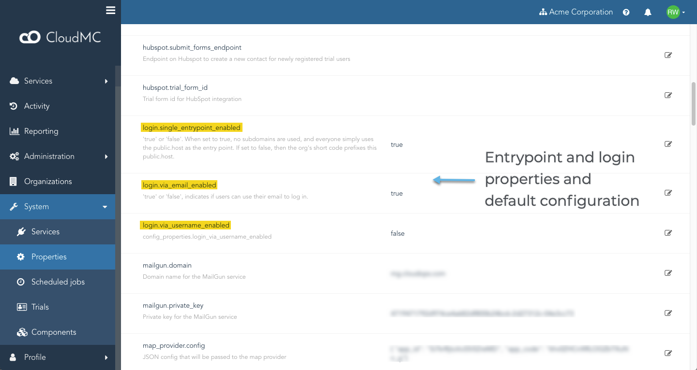

# Administrator guide:  Presenting CloudMC Services and URLs

When planning a deployment of CloudMC, it is important to decide how the CloudMC Web user interface and API will be presented to end-users.  Will there be a single URL for all organizations, or will each organization be accessed via a custom URL unique to that organization?  CloudMC provides the cloud operator with both of these options.
- Single-entrypoint: All services are exposed via a single common domain name, and the login page is accessed via a common URL with that domain name.  This is the default behaviour
- Multi-entrypoint: Each organization receives a unique domain name, and the login page is accessed via a URL with that unique domain name

## Login entrypoint models
### Single-entrypoint
CloudMC can be configured to provide logins for end-users via a single common URL.  The URL is simply the value of the *public.host* property with no sub-domain.  This URL is the same for all organizations in the system.  All end-users see the same login page with the system branding.

Under this model, it is recommended that the following system properties be configured accordingly:
- **Login via email address** should be enabled
- **Login via username** should be disabled

The above two properties control whether end-users can log in with a username, an email address, or both.  Though it is not required that usernames be disabled and email addresses required, in practice it is easier for end-users to identify themselves with their email address, normally a unique attribute and is difficult to forget.

With single-entrypoint enabled, accounts must be local.  Organizations cannot have LDAP login configured, because the organization of the end-user is not identified until the user is authenticated.  User accounts are created within each organization, but each account must have an email address that is unique across all organizations in the system (or username if login by username is enabled).

### Multi-entrypoint
CloudMC can be configured to provide logins for end-users via a URL that is unique for each organization.  When multi-entrypoint login is configured, each organization will be associated with an organization code.  The organization code is used as the subdomain for the URL, and the value of the *public.host* property is appended to form the complete domain name for the URL.

Under this model, users are created within each organization, and are completely isolated from other organizations.  This means that both Organization A and Organization B could have users named UserA.  There is no ambiguity for authentication because CloudMC knows which organization to look for when attempting to login, based on the URL that the end-user has accessed.

Because each organization has a unique URL, the login page can be customized with a logo for branding for each organization.

### Comparison
| Feature | Single-entrypoint | Multi-entrypoint |
| --- | --- | --- |
| Common URL for all organizations | Yes | No |
| Each organization is accessed via a unique URL | No | Yes
| Custom logo on login page | No | Yes |
| LDAP authentication | No | Yes |
| URL based on the customer name | No | Yes |
| Role-based access control | Yes | Yes |
| Trials can introduce lengthy and arbitrary domain names | No | Yes |

## How to implement
### Properties to set
The login model is controlled by CloudMC system properties, *System* -> *Properties*.  This requires the Operator role, or the *Configuration properties: Manage* permission assigned with a scope of **All Organizations**.

To enable single-entrypoint (enabled by default):
- **single_entrypoint_enabled** = true

To enable multi-entrypoint:
- **single_entrypoint_enabled** = false

When single-entrypoint is enabled, it is recommended to have the following two properties set accordingly:
- **login_via_email_enabled** = true
- **login_via_username_enabled** = false

### Changing login model
Conflicting emails or usernames will have to be manually resolved prior to enabling single-entrypoint
